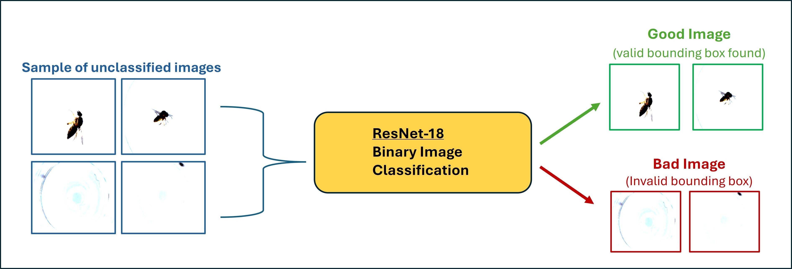

<div style="width: 1000px; font-size: 18px;">

# Image Filtering Tool


Classifies images as good or bad based on the presence of a valid bounding box

# Overview




The image filtering tool uses ResNet-18 CNN to classify images based on the presence of a valid bounding box. It automates the image annotation process, saving time and ensuring consistent, standardized classification, thereby eliminating manual dataset labeling. This is particularly advantageous for large-scale image datasets, improving efficiency and accuracy in data preparation. By filtering out images without valid bounding boxes, it maintains dataset integrity, crucial for training reliable machine learning models. ResNet-18’s robustness ensures precise and reliable classification, making it valuable across various machine learning workflows.

# Dataset
The filtering tool has been trained and validated on a collection of 929 diverse insect records that vary widely in image quality. Some images are clear and well-defined, with easily identifiable bounding boxes, while others may be blurry or lack adequate bounding box annotations.

### i) Dataset Consists Of:
- Diverse set of 929 insect images
- Manually annotations for each image

### ii) Dataset Partition:
  - Training Set:
    - Total Images: 742
    - Good Images: 668
    - Bad Images: 74
  - Validation Set:
    - Total Images: 187
    - Good Images: 168
    - Bad Images: 19


# Implement Tool

## 1. Activate wandb
### Register/Login for a [free wandb account](https://wandb.ai/site)
This enables tracking of training and evaluation metrics over time.
```shell
wandb login
# Paste your wandb API key
```

## 2. Split data into train and validation sets:
This step divides the dataset into training and validation sets, each categorized into 'good' and 'bad' images.

```
python data_processing/split_data.py --input_dir dataset/failed_crop_subset --dataset_name dataset/data_splits
```

## 3. To train and evaluate the model:
The model is trained over 742 labeled images and validated over 187 previously unseen images that have been classified as good/bad. 
```
python scripts/training.py
```

## 4. To view the model's inference:
An image randomly chosen from the validation set is classified as either 'good' or 'bad' based on the model's prediction. The resulting classification and corresponding image are displayed, offering visual confirmation of the model's accuracy.
```
python scripts/inference.py
```

</div>
