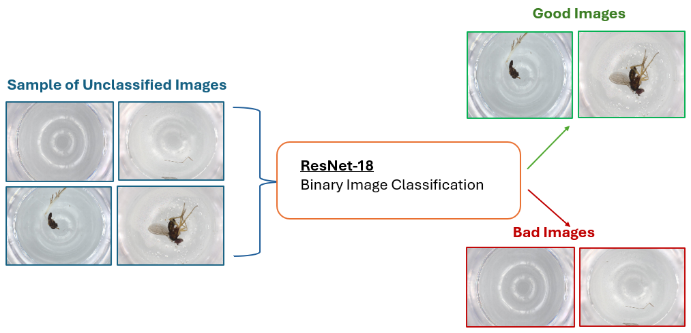

<div style="width: 1000px; font-size: 18px;"

# Bioscan-IMGFILTER
Classifies images as good or bad based on the presence of a valid bounding box

# Overview




The image filtering tool uses the pre-trained ResNet-18 CNN to classify images based on the presence of a valid bounding box. It automates the image annotation process, saving time and ensuring consistent, standardized classification, thereby eliminating manual dataset labeling. This is particularly advantageous for large-scale image datasets, improving efficiency and accuracy in data preparation. By filtering out images without valid bounding boxes, it maintains dataset integrity, crucial for training reliable machine learning models. ResNet-18’s robustness ensures precise and reliable classification, making it valuable across various machine learning workflows.


# The Model 

The ResNet-18 CNN, pretrained on the ImageNet dataset was used for binary classification. ResNet-18 is less computationally intensive and faster to train compared to deeper versions, making it a suitable choice for binary classification tasks, which typically do not require extremely deep networks. Moreover, it reports a 91% training and 90% validation accuracy score making it an effective and effiecient model for this task. 


# The Dataset
 
The filtering tool utilizes the "failed crop dataset" subset from Bioscan-1M which primarily consists of images that failed initial cropping attempts. This allows us to tackle the most challenging instances where our current image processing pipeline may struggle, whether due to genuine quality issues or processing failures. Some images are clear and well-defined, with easily identifiable bounding boxes, while others may be blurry or lack adequate bounding box annotations. Integrating this dataset aims to improve the overall performance and accuracy of our image processing system, ensuring robustness across diverse image types and conditions.

### i) Dataset Consists Of:
- Diverse set of 929 insect images
- Manually annotations for each image

### ii) Dataset Partition:
  - Training Set:
    - Total Images: 742
    - Good Images: 668
    - Bad Images: 74
    - Validation Set:
    - Total Images: 187
    - Good Images: 168
    - Bad Images: 19

### iii) Annotations 
The dataset has been annotated to include bounding boxes identifying objects. Every image containing any object, regardless of its quality, size, or type, is annotated with a bounding box. Only completely empty dish images are not annotated with a bounding box.

# Implement Tool

## 1. Activate wandb
### Register/Login for a [free wandb account](https://wandb.ai/site)
This enables tracking of training and evaluation metrics over time.
```shell
wandb login
# Paste your wandb API key
```

## 2. To train and evaluate the model:
The model is trained over 742 labeled images and validated over 187 previously unseen images that have been classified as good/bad. 
```
python scripts/training.py
```

## 3. To view the model's inference:
An image randomly chosen from the validation set is classified as either 'good' or 'bad' based on the model's prediction. The resulting classification and corresponding image are displayed, offering visual confirmation of the model's accuracy.
```
python scripts/inference.py
```

</div>
