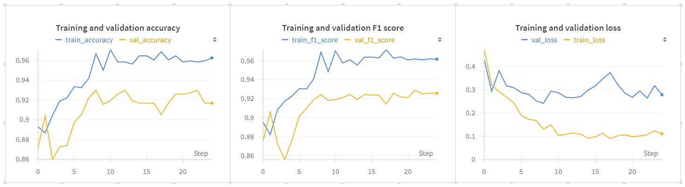
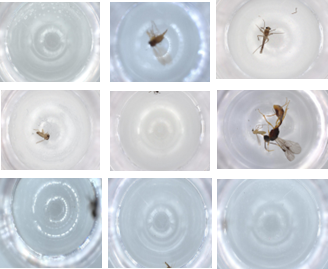

<div style="width: 1000px; font-size: 18px;"

#
# BIOSCAN - IMAGE FILTER
A specialized image filtering tool that categorizes images into 'good' and 'bad' based on insect visibility, reducing the need for manual labeling while enhancing overall robustness.


# Overview 


The image filtering tool uses the pre-trained ResNet-18 CNN to classify images as "good" or "bad" by evaluating each image's bounding box, resolution, and fragmentation parameters. It automates the image annotation process, saving time and ensuring consistent, standardized classification, thereby reducing the need for manual dataset labeling. This is particularly advantageous for large-scale image datasets, improving efficiency and accuracy in data preparation. By filtering out images with invalid parameters, it maintains dataset integrity, crucial for training reliable machine learning models. ResNet-18’s robustness ensures precise and reliable classification, making it valuable across various machine learning workflows.
<br><br>

# Good vs Bad image distinction

**Good** images are classified as having **all** of the following characteristics:
- Bounded object (image with a valid bounding box)
- Clear resolution 
- Whole/not fragmented


**Bad** images are classifed as having **any** of the following characteristics:
- Unbounded objects (image without a bounded object) 
- Blurry resolution
- Fragmented (ie: majority of the image is cut off, only a wing/leg depicted, etc)


# The Model

The ResNet-18 CNN, pretrained on the ImageNet dataset was used for binary classification. ResNet-18 is less computationally intensive and faster to train compared to deeper versions, making it a suitable choice for binary classification tasks, which typically do not require extremely deep networks. 

## i) Performance 
The model reports increasingly high accuracy and F1 scores complemented by respectively low losses for both the training and validation splits, indicating effective learning and reliable real-world performance.  



<br>

# The Dataset

## Subset of the dataset


The filtering tool utilizes the "failed crop dataset" subset from Bioscan-1M, focusing on images that failed initial cropping attempts. This allows us to tackle the most challenging instances where our current image processing pipeline may struggle, whether due to genuine quality issues or processing failures. Some images are clear and well-defined, with easily identifiable bounding boxes, while others may be poor quality/blurry. Integrating this dataset aims to improve the overall performance and accuracy of our image processing system, ensuring robustness across diverse image types and conditions. 

### i) Dataset Consists Of:
- Diverse set of 929 insect images
- Manually annotations for each image

### ii) Dataset Partition:
  - Training Set:
    - Total Images: 936
    - Good Images: 668
    - Bad Images: 268
  - Validation Set:
    - Total Images: 236
    - Good Images: 168
    - Bad Images: 68

### iii) Annotations 
The dataset has been annotated to include bounding boxes identifying objects. Every image containing any object, regardless of its quality, size, or type, is annotated with a bounding box. Only completely empty dish images are not annotated with a bounding box. 
<br><br>
# Implement Tool

## 1. Setup Environment 
### Download [Anaconda](https://www.anaconda.com/download) onto your computer 
```shell
conda create -n Bioscan-ImgFilter python=3.10
conda activate Bioscan-ImgFilter
pip install -r requirements.txt 
```

## 2. Activate wandb
### Register/Login for a [free wandb account](https://wandb.ai/site)
This enables tracking of training and evaluation metrics over time.
```shell
wandb login
# Paste your wandb API key
```

## 3. To train and evaluate the model
The model is trained over 742 labeled images and validated over 187 previously unseen images that have been classified as good/bad. 
```
python scripts/training.py
```

## 4. To view the model's inference
An image randomly chosen from the validation set is classified as either 'good' or 'bad' based on the model's prediction. The resulting classification and corresponding image are displayed, offering visual confirmation of the model's accuracy.
```
python scripts/inference.py
```

</div>
